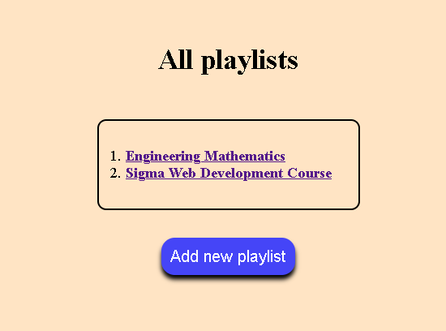
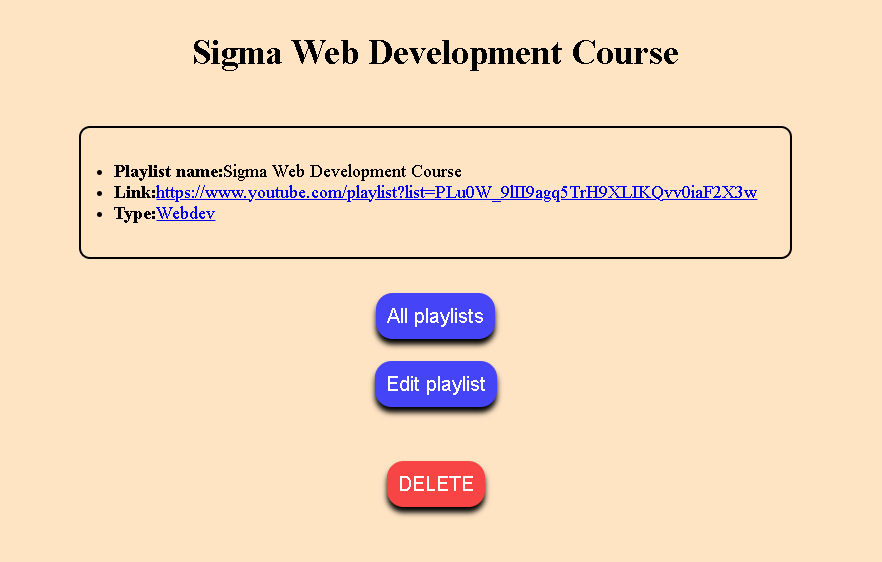

# Lv2_YTPlaylist

A small CRUD-based web app built with **Express, MongoDB, and EJS** to practice database operations and server-side rendering.  
The app lets you create, view, edit, delete, and filter YouTube-style playlists by category.

## Tech Stack
- Node.js
- Express
- MongoDB + Mongoose
- EJS
- Method-Override
- CSS (vanilla)

## Features
- Add playlists with name, link, and type
- View all playlists or filter by category
- Edit existing playlists
- Delete playlists
- Server-rendered UI using EJS
- MongoDB-backed persistence

## Project Structure
- `index.js` → Main Express server and routes
- `models/playlists.js` → Mongoose schema/model
- `views/playlistEJS/` → EJS templates (CRUD UI)
- `public/` → Static assets (CSS, images)
- `seeds.js` → Sample data seeding script

 
 

## Setup & Run
1. Make sure MongoDB is running locally
2. Install dependencies:
   ```bash
   npm install
   ```

3. (Optional) Seed database:

   ```bash
   node seeds.js
   ```
4. Start server:

   ```bash
   node index.js
   ```
5. Open browser at:

   ```
   http://localhost:3000/playlists
   not http://localhost:3000/ because theres no default route i set for this project
   ```

## Notes

* This project focuses on learning **CRUD + MongoDB workflow**
* UI is intentionally simple and easy to customize
* Can be extended into a full todo or playlist manager app

Good base project for understanding how Express, Mongoose, and EJS work together.
